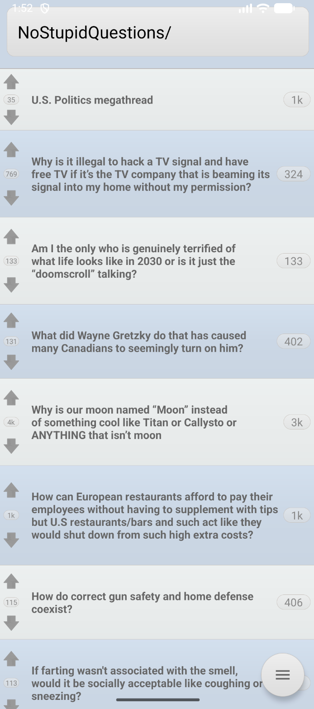
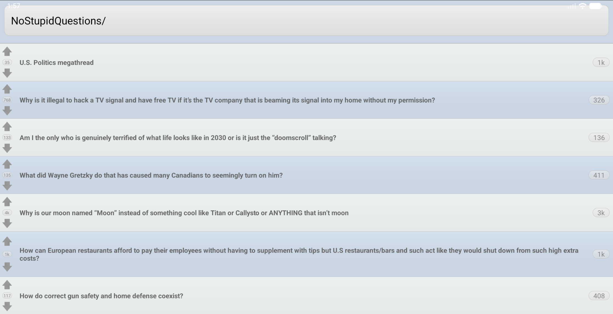
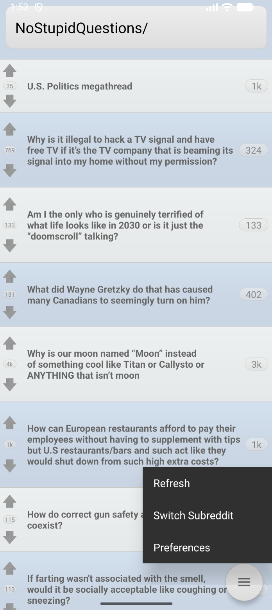
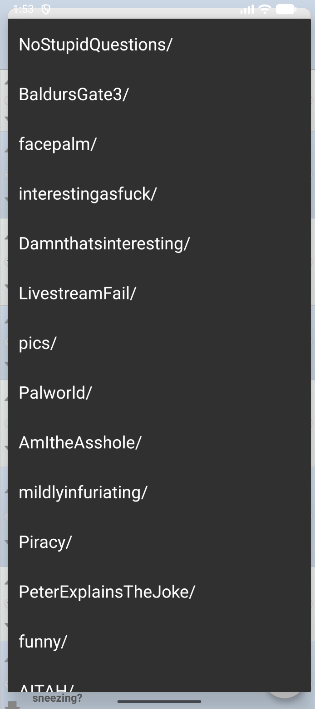
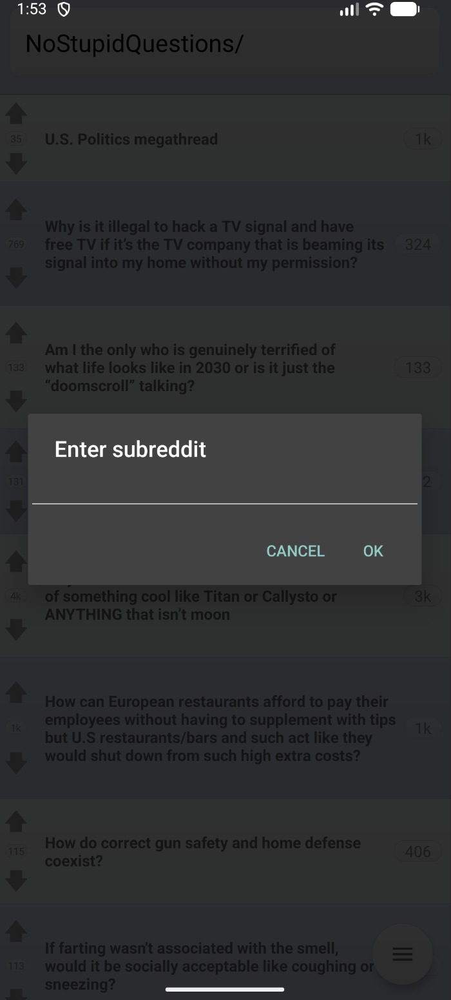

# Ourobo

A lightweight Reddit client for Android.

## Features

- Browse subreddits and switch between them
- View post thumbnails, titles, and scores
- Upvote and downvote posts
- Open posts and comments in a built-in WebView browser
- Add custom subreddits via long-press on the subreddit selector
- Reddit account login with encrypted credential storage (AES-256 via Android Keystore)

## Screenshots

| Post list | Landscape | Menu | Subreddit selector | Custom subreddit |
|---|---|---|---|---|
|  |  |  |  |  |

## Requirements

- Android 6.0+ (API 23)
- Internet permission

## Building

Requires Java 11 and the Android SDK (compileSdk 35).

```sh
# Debug build
./gradlew assembleDebug

# Release build
./gradlew assembleRelease

# Install debug build on connected device
./gradlew installDebug

# Run tests
./gradlew test
```

APKs are output to `Ourobo/build/outputs/apk/` with the naming convention `ourobo_<variant>_<version>.apk`.

## Project Structure

```
Ourobo/
  src/                  # Application source (Java)
  res/                  # Android resources (layouts, drawables, values)
  test/src/             # Unit tests
  AndroidManifest.xml
  build.gradle
OuroboTest/
  src/                  # Instrumentation tests
```

## License

MIT - See [LICENSE.md](LICENSE.md) for details.
